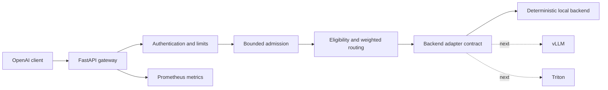

# InferenceMesh

[](https://github.com/bprithiraj/InferenceMesh/actions/workflows/ci.yml)
[](https://www.python.org/)
[](LICENSE)

InferenceMesh is an SLO-aware, OpenAI-compatible inference control plane. It explores a practical systems problem: when models and serving engines have different latency, quality, cost, capacity, and health characteristics, how should a gateway select the safest eligible route while remaining stable under load?

This repository is being built as a production-shaped personal project. Each release must run, be testable, and clearly separate implemented behavior from the roadmap.

## What works in v0.1

- OpenAI-compatible `POST /v1/chat/completions`, including SSE token streaming.
- OpenAI-compatible `POST /v1/embeddings` and `GET /v1/models`.
- Hard backend eligibility filters followed by deterministic weighted routing.
- Route-decision headers explaining the selected backend and policy version.
- Bounded global concurrency, per-tenant concurrency, queue depth, and queue wait.
- Optional bearer/API-key authentication and request/output limits.
- Request IDs, health/readiness checks, Prometheus metrics, and a sanitized demo summary.
- Deterministic local backend for zero-cost development, CI, contract tests, and failure testing.
- Docker, Docker Compose, Kubernetes, and Render deployment definitions.
- Unit, contract, streaming, authentication, routing, and concurrency tests.
- A versioned gRPC contract for the next transport milestone.

The deterministic backend is intentional: it proves the gateway behavior without pretending a laptop is a GPU platform. Real vLLM text generation, Triton embeddings, MLflow rollout controls, Redis caching, Kafka batches, and the public GPU deployment are tracked in the [roadmap](docs/roadmap.md).

## Architecture



The synchronous request path deliberately excludes Kafka and MLflow. Control-plane failures must not prevent the last validated serving configuration from handling online traffic. Read the [full architecture](docs/architecture.md) and [implementation plan](docs/development-plan.md).

## Quick start

Requires Python 3.12 or newer.

```powershell
git clone https://github.com/bprithiraj/InferenceMesh.git
cd InferenceMesh
python -m venv .venv
.\.venv\Scripts\Activate.ps1
python -m pip install -e ".[dev]"
uvicorn inferencemesh.main:app --reload
```

Open:

- API documentation: `http://127.0.0.1:8000/docs`
- Readiness: `http://127.0.0.1:8000/health/ready`
- Metrics: `http://127.0.0.1:8000/metrics`
- Sanitized demo status: `http://127.0.0.1:8000/demo/metrics/summary`

Run the smoke test in another terminal:

```powershell
.\.venv\Scripts\python.exe scripts\smoke_test.py
```

## Try the API

Unary chat completion:

```powershell
$body = @{
  model = "inferencemesh-local"
  messages = @(@{ role = "user"; content = "Why should an inference queue be bounded?" })
  temperature = 0
  max_tokens = 96
} | ConvertTo-Json -Depth 5

Invoke-RestMethod -Uri http://127.0.0.1:8000/v1/chat/completions `
  -Method Post -ContentType application/json -Body $body
```

Streaming with curl:

```bash
curl -N http://127.0.0.1:8000/v1/chat/completions \
  -H "Content-Type: application/json" \
  -d '{"model":"inferencemesh-local","messages":[{"role":"user","content":"Stream a routing decision"}],"stream":true}'
```

The response includes:

- `x-inferencemesh-request-id`
- `x-inferencemesh-backend`
- `x-inferencemesh-model-version`
- `x-inferencemesh-policy-version`
- `x-inferencemesh-route-reason`

## Verify

```powershell
ruff check .
ruff format --check .
mypy src
pytest
```

## Run with containers

```bash
docker compose up --build
```

The image runs as a non-root user with a read-only filesystem in Compose. See [getting started](docs/getting-started.md) for configuration and [API behavior](docs/api.md) for supported compatibility details.

## Deploy

The repository includes three deployment paths:

- `render.yaml` for an inexpensive CPU demonstration of the gateway contract.
- `Dockerfile` for any container platform.
- `deploy/kubernetes/` for the production-shaped gateway deployment.

The CPU demo is not presented as an LLM benchmark. Performance claims will be published only after the reference GPU environment, models, workload, and raw result artifacts are pinned.

## Repository map

```text
src/inferencemesh/     gateway, domain, routing, admission, adapters, metrics
tests/                 unit and API contract tests
proto/                 versioned gRPC API contract
deploy/kubernetes/     deployable gateway manifests
benchmarks/            reproducible benchmark runner and methodology
scripts/               smoke tests
docs/                  architecture, API, decisions, roadmap, implementation plan
```

## Engineering decisions

- Filter for capability, health, and circuit state before scoring performance.
- Reject overload predictably instead of allowing unbounded memory growth.
- Never change backends after the first streamed token.
- Keep backend-specific shapes behind adapters.
- Make route decisions observable without logging prompt content.
- Publish benchmark context and raw artifacts with every resume metric.

See the [decision record](docs/adr/README.md) for the choices that constrain future milestones.

## Project status

InferenceMesh is under active development. Version `0.1.0` is the verified gateway foundation; it is not yet the final GPU-backed public demonstration. Issues and pull requests are welcome.

## License

[MIT](LICENSE)
