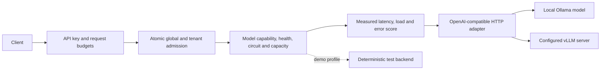

# InferenceMesh

[](https://github.com/bprithiraj/InferenceMesh/actions/workflows/ci.yml)

A small inference gateway that protects model-serving capacity and explains its
routing decisions. v0.2 runs real OpenAI-compatible HTTP backends, including a local
Ollama profile and a vLLM-compatible profile. It remains a single-process personal
systems project with explicit boundaries.

## Implemented in v0.2

- Unary chat, SSE streaming, embedding requests and public model discovery.
- Configurable public aliases mapped to actual upstream model IDs and capabilities.
- HTTP connection cleanup on client disconnect; upstream finish reasons and token usage preserved.
- Bounded global and per-tenant admission with FIFO fairness among eligible tenants.
  A saturated tenant cannot reserve another tenant's free slot.
- Health probes, measured latency/load/error scoring, capacity limits, circuit breaking
  and single half-open recovery probes.
- Alternate backend attempts before streamed content begins; no midstream switching.
- API-key mode, per-process request/output budgets and separately protected metrics.
- Deterministic demo mode, meaningful failure/cancellation tests, CI/container definitions.
- Direct-backend versus gateway benchmark runner with raw CSV and JSON metadata.

The HTTP adapter is real implementation. A CPU Ollama run validates that protocol
path; it is not evidence of vLLM GPU throughput. No cloud resources are created by
running the local setup.

## Run locally

Requires Python 3.12 or newer.

```powershell
python -m venv .venv
.\.venv\Scripts\Activate.ps1
python -m pip install -e ".[dev]"
uvicorn inferencemesh.main:app --host 127.0.0.1 --port 8000
```

This command defaults to explicit deterministic `demo` mode.
To run an actual downloaded CPU model, follow [local serving](docs/local-serving.md).
No paid provider or API credits are required for that path.

- API docs: `http://127.0.0.1:8000/docs`
- Model IDs: `http://127.0.0.1:8000/v1/models`
- Readiness: `http://127.0.0.1:8000/health/ready`
- Sanitized status: `http://127.0.0.1:8000/demo/metrics/summary`

Full `/metrics` is disabled until a separate metrics key is configured.

## Request path



The online path has no Kafka, Redis, MLflow or database dependency. Backend clients
are pooled and closed on shutdown. Each request tries an eligible backend at most
once. If a stream fails after output begins, the client receives a sanitized error
event without a false success terminator.

## Verify and compare

```powershell
ruff check .
ruff format --check .
mypy src
pytest
python scripts/smoke_test.py
```

The smoke script uses demo model IDs. Use the examples in
[local serving](docs/local-serving.md) for real model aliases.

Run [the benchmark](benchmarks/README.md) to produce inspectable source/hardware/model
metadata, request rows, TTFT, latency quantiles, throughput and rejection counts.
Performance claims require actual saved results and enough repeated samples.

## Deliberate limits

- One gateway worker; admission, circuit state and budgets are process-local.
- A configured API key identifies one tenant; this is not a customer account system.
- HTTP embeddings are supported; a native Triton gRPC adapter is not implemented.
- The protobuf schema is a contract only; no running gRPC gateway is claimed.
- Distributed quotas, exact/semantic caches, MLflow rollout controls, Kafka batches
  and an unrestricted public GPU demo remain future work.
- Model availability probes do not establish model quality or an end-to-end SLO.
- Docker/Render/Kubernetes definitions are deployment assets, not evidence of live deployment.

See [API behavior](docs/api.md), [roadmap](docs/roadmap.md),
[changelog](CHANGELOG.md), [contributing](CONTRIBUTING.md) and [security](SECURITY.md).

[MIT license](LICENSE).
