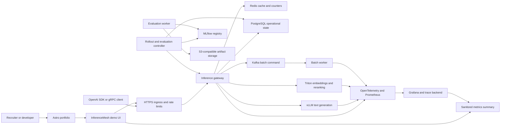
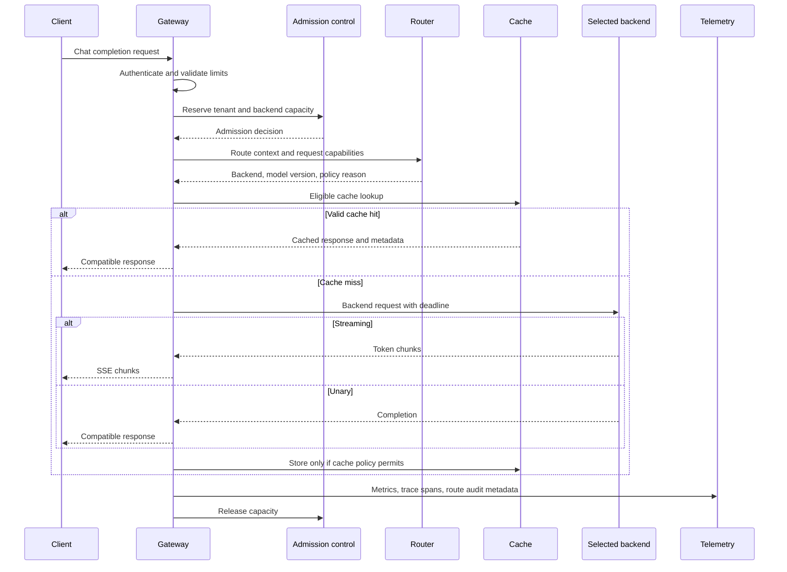
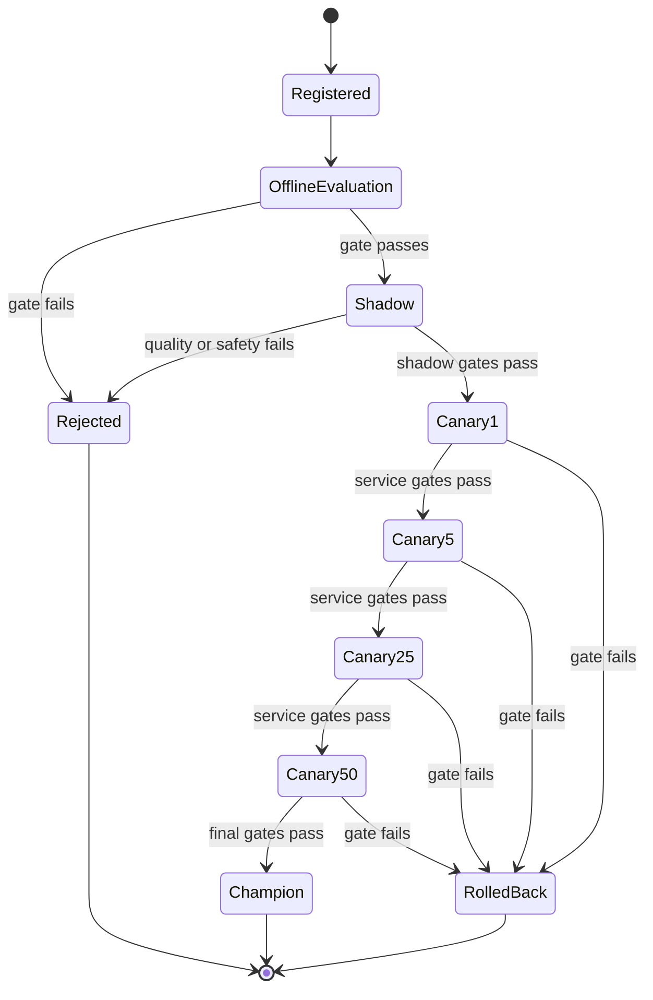
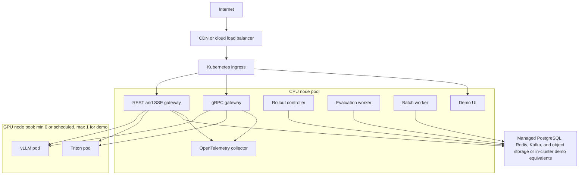

# InferenceMesh Architecture

**Status:** Proposed implementation architecture
**Planning date:** 2026-07-23
**Product:** A recruiter-accessible, SLO-aware inference control plane for text generation, embeddings, safe model rollout, and asynchronous batch inference.

## 1. Product definition

InferenceMesh is not intended to be another wrapper around an LLM API. Its central engineering problem is:

> Given multiple model versions and serving backends with different latency, quality, cost, and health characteristics, select the safest eligible route for each request while protecting the system under load and preserving an OpenAI-compatible client contract.

The project demonstrates four capabilities together:

1. **Inference data plane:** low-latency REST and gRPC APIs, streaming, cancellation, bounded queues, batching, caching, and backend adapters.
2. **Inference control plane:** model eligibility, version aliases, routing policy, canary progression, evaluation gates, rollback, and audit history.
3. **Production operations:** Kubernetes deployment, GPU scheduling, rate limiting, observability, load testing, failure injection, and cost controls.
4. **Engineering communication:** reproducible benchmarks, architecture decisions, a public demo, a short failure-recovery video, and a portfolio case study linked to the source.

## 2. Success criteria

The first public release is complete only when all of the following are true:

- [OpenAI Responses API](https://platform.openai.com/docs/api-reference/responses) A standard OpenAI client can call `/v1/chat/completions`, receive a non-streaming response, and consume an SSE streaming response without custom response parsing.
- A real vLLM backend serves a publicly licensed small language model on a GPU environment.
- Triton serves an embedding or reranking model through its gRPC interface; it is not used as a redundant checkbox text-generation backend.
- The router records why it selected a model and backend without exposing private policy details to public clients.
- Overload results in bounded, observable `429` or `503` responses instead of unbounded memory growth.
- A failed or slow backend is removed from selection by a circuit breaker and requests fail over before streaming begins.
- A candidate model can receive shadow traffic and a deterministic canary percentage, fail an evaluation gate, and roll back to the champion without redeploying the gateway.
- Load and failure tests publish hardware, model, dataset, concurrency, input/output token distributions, and raw result artifacts.
- A recruiter can reach the live demo from the portfolio, inspect the GitHub repository without credentials, run a guided request, view a safe metrics summary, and watch a two-minute rollback demonstration.
- The local core system starts with one documented command; GPU-specific components have an explicit optional profile and prerequisites.

Initial engineering targets are acceptance thresholds, not resume claims. They must be recalibrated after the first hardware baseline:

| Signal | Initial target |
| --- | --- |
| Gateway overhead | p95 no more than 50 ms or 5% over direct-backend p95, whichever is larger |
| Streaming cancellation propagation | Backend cancellation observed within 2 seconds |
| Reference-load success rate | At least 99% excluding intentionally injected failures |
| Queue behavior | Queue length never exceeds its configured bound |
| Canary exposure | Observed traffic allocation within 2 percentage points of configured allocation over a sufficiently large deterministic test set |
| Automatic rollback | Route returns to champion within 60 seconds of a confirmed gate violation |
| Tenant isolation | Zero cross-tenant cache hits and zero cross-tenant usage records in automated tests |
| Public-demo safety | Guest request and token limits enforced under concurrent abuse tests |

## 3. Scope boundaries

### Included in the first public release

- OpenAI Responses API-compatible inference
s, streaming, model listing, and embeddings.
- A public REST interface and a documented gRPC inference interface.
- vLLM for text generation and Triton for embeddings or reranking.
- Rule-based SLO, cost, quality, capacity, and health-aware routing.
- Exact caching followed by guarded semantic caching.
- API-key authentication, guest sessions, tenant quotas, token budgets, and audit events.
- MLflow model versions, tags, and `champion` / `candidate` aliases.
- Shadow evaluation, canary traffic, promotion, and rollback.
- Kafka-based asynchronous batch inference with idempotency and a dead-letter path.
- PostgreSQL for durable application state and MLflow metadata.
- Redis for ephemeral counters, cache entries, and short-lived routing state.
- S3-compatible object storage for model/evaluation artifacts and batch inputs/outputs.
- OpenTelemetry traces, Prometheus metrics, structured logs, and Grafana dashboards.
- Docker Compose for local dependencies and Helm for the deployable Kubernetes topology.

### Explicitly deferred

- Model training or fine-tuning.
- A Kubernetes operator or custom scheduler.
- Multi-region active-active deployment.
- Arbitrary user-provided models or code execution.
- Every OpenAI API endpoint and every optional request parameter.
- Transparent failover after the first streamed token has been emitted.
- Ray Serve in the first release. It becomes an adapter only if a measured multi-stage pipeline requires Python-native composition or independent autoscaling.
- A learned router. The first release uses an explainable policy with recorded inputs and deterministic decisions.

## 4. Architectural principles

1. **Separate data plane from control plane.** Online requests must not depend on Kafka, MLflow availability, or an evaluation job completing.
2. **Use hard eligibility filters before scoring.** Capability, context length, tenant policy, health, and budget constraints cannot be traded away by a weighted score.
3. **Keep the gateway contract stable.** Backend-specific request and response shapes terminate at adapters.
4. **Prefer explicit degradation.** Cache bypasses, fallback routes, and stale control-plane snapshots are observable states.
5. **Bound every resource.** Request bodies, token counts, concurrency, queue length, timeouts, retries, cache memory, Kafka retries, and public-demo usage all have limits.
6. **Never hide benchmark context.** Performance numbers without hardware, model, workload, and configuration are not published.
7. **Do not store prompt content by default.** Operational telemetry contains identifiers, sizes, timings, and route metadata, not user text.

## 5. System context



## 6. Data-plane architecture

### 6.1 Edge and public access

The ingress terminates TLS and applies a coarse IP-based limit before traffic reaches the application. The gateway then enforces tenant or guest-session limits using Redis-backed counters.

Public browser access uses a short-lived guest token issued by `/demo/session`; a permanent API key is never embedded in the portfolio or JavaScript bundle. The token permits only approved models and endpoints and has strict request, prompt-token, output-token, and concurrency limits. CORS allows only the deployed portfolio and demo origins.

Administrative, MLflow, raw Prometheus, Redis, Kafka, PostgreSQL, and backend model-server endpoints remain private.

### 6.2 Gateway processes

Two transport processes share the same application packages:

- **REST/SSE gateway:** FastAPI with an ASGI server exposes OpenAI-compatible HTTP endpoints and streaming Server-Sent Events.
- **gRPC gateway:** `grpc.aio` exposes the repository-owned `InferenceService` contract for unary and server-streaming requests.

The processes share contracts, authentication, admission control, routing, caching, adapters, telemetry, and error mapping. They are independently deployable so a fault or scaling decision in one transport does not require combining two servers in one process.

The gateway is initially a modular service, not many small network services. Routing and cache policy run in-process on versioned configuration snapshots to avoid a network hop on every token request.

### 6.3 External API surface

| Endpoint | Purpose | Public guest access |
| --- | --- | --- |
| `GET /health/live` | Process liveness | Yes |
| `GET /health/ready` | Dependency-aware readiness | Yes |
| `GET /v1/models` | Allowed logical model names | Yes, filtered |
| `POST /v1/chat/completions` | Unary or SSE text generation | Yes, limited |
| `POST /v1/embeddings` | Embeddings through Triton | Yes, limited |
| `POST /v1/batches` | Create asynchronous batch job | Authenticated tenants only |
| `GET /v1/batches/{id}` | Read batch state and result reference | Owning tenant only |
| `POST /v1/batches/{id}/cancel` | Request cancellation | Owning tenant only |
| `POST /demo/session` | Issue a short-lived restricted guest token | Yes, rate-limited |
| `GET /demo/metrics/summary` | Sanitized live service indicators | Yes |
| `GET /metrics` | Prometheus scrape endpoint | Cluster only |

OpenAI-compatible response bodies remain portable. InferenceMesh-specific information is returned through optional headers:

- `x-inferencemesh-request-id`
- `x-inferencemesh-model-version`
- `x-inferencemesh-cache`
- `server-timing`

Detailed route reasons are available to authenticated operators and benchmark artifacts, not arbitrary public clients.

### 6.4 Online request sequence



Before the first streamed token, retry or fallback is allowed only when the failure class is safe and the deadline leaves enough time. After streaming begins, the gateway terminates the stream with an observable error rather than silently switching models and producing an incoherent completion.

Client cancellation propagates through the adapter and releases the admission permit. A disconnected client must not leave generation consuming GPU capacity indefinitely.

### 6.5 Admission control and backpressure

Admission occurs before cache and backend work:

1. Validate body size, input-token estimate, requested output tokens, model capability, and tenant allowance.
2. Consume rate and token-budget counters atomically.
3. Acquire a bounded tenant concurrency permit.
4. Acquire or queue for a bounded backend permit with a short deadline.
5. Reject excess demand with a retryable `429` or `503` and `Retry-After` where appropriate.

The queue is not an unbounded Python collection. Queue depth, wait duration, rejection count, and active permits are metrics. Limits are configuration, versioned with routing policy.

### 6.6 Backend adapters

All adapters implement a common interface:

- capability declaration;
- health and readiness probe;
- unary inference;
- streaming inference where supported;
- cancellation;
- normalized usage and timing metadata;
- backend-specific error classification.

**vLLM adapter:** uses the backend's OpenAI-compatible HTTP interface for text generation and scrapes its Prometheus metrics. vLLM already provides compatible serving and a `/metrics` endpoint, so InferenceMesh focuses on cross-backend policy and safety instead of recreating the engine.

**Triton adapter:** uses Triton's gRPC inference protocol for an embedding or reranking model. Triton's model repository, dynamic batching, readiness endpoints, and Prometheus metrics are configured and observed as part of the deployment.

**Ray Serve adapter:** remains behind a plugin boundary. It is implemented only after a multi-stage example proves a need for Python-native composition or independently autoscaled stages; otherwise it would add operational complexity without a distinct responsibility.

## 7. Routing architecture

### 7.1 Logical model contract

Clients request a logical model such as `inferencemesh-chat-small`, not a pod, engine, or mutable artifact version. A route configuration maps the logical name to eligible model versions and backends.

Each candidate declares:

- supported task and features;
- tokenizer and maximum context;
- artifact and model revision;
- serving backend and endpoint identity;
- quality score from the approved evaluation suite;
- estimated cost per input/output token for the reference hardware;
- health, saturation, and circuit state;
- rollout role and traffic allocation;
- tenant and environment eligibility.

### 7.2 Selection algorithm

The router first applies hard filters:

1. tenant is allowed to use the logical model;
2. candidate supports the requested task, context, streaming, and tool requirements;
3. estimated token cost fits the request or tenant budget;
4. backend is ready and its circuit is not open;
5. queue and concurrency capacity are available;
6. rollout allocation permits the request to reach that candidate.

The remaining candidates receive an explainable lower-is-better score:

```text
score =
  w_latency * predicted_ttft_ratio
  + w_queue * queue_utilization
  + w_cost * estimated_cost_ratio
  + w_quality * quality_penalty
  + w_error * recent_error_rate
```

Inputs use bounded rolling windows and exponentially weighted moving averages. Missing or stale signals receive an explicit conservative penalty. Tie-breaking is deterministic. Every decision records the policy version, eligible set, selected target, and compact reason codes.

Canary assignment uses a stable hash of tenant, logical model, and request group so related requests do not oscillate between champion and candidate.

### 7.3 Circuit breaker

The circuit has closed, open, and half-open states. It opens for qualifying transport errors, readiness failures, or latency breaches over a bounded window; it does not open for client validation errors. Half-open probes have dedicated low concurrency. State changes produce audit events and alerts.

## 8. Cache architecture

Caching is introduced in two stages.

### 8.1 Exact cache

The exact key includes tenant/cache namespace, logical model, immutable model version, system and user messages, tools, relevant sampling parameters, locale, and policy version. Entries have a TTL and are non-authoritative.

Requests are not cached when they use streaming during the initial release, non-deterministic sampling above the configured threshold, tool calls, unsupported multimodal content, sensitive-data flags, or an opt-out header.

### 8.2 Semantic cache

Triton produces the query embedding. Redis vector search applies nearest-neighbor similarity together with hard tenant, locale, model-version, safety, and policy filters in the same lookup. A hit is usable only when it passes both the similarity threshold and the hard metadata constraints.

Threshold selection comes from a labeled paraphrase/non-paraphrase evaluation set. The release gate evaluates false-hit rate, not only cache-hit rate. Arbitrary public-demo prompts are not persisted in the semantic cache; the live demo uses an approved synthetic prompt corpus. Tenant semantic caching is opt-in with short TTLs.

## 9. Control-plane architecture

### 9.1 Model registry ownership

MLflow owns model version metadata, artifacts, evaluation run links, tags, and aliases. It runs with a database-backed store. InferenceMesh uses:

- `candidate` for a version under evaluation or canary;
- `champion` for the currently approved version;
- tags for validation state, tokenizer revision, serving image, license review, and evaluation-suite version.

Gateway instances do not query MLflow for every request. A rollout controller validates registry changes, writes an immutable route-policy snapshot to PostgreSQL, and publishes a version notification. Gateways poll or subscribe, validate the snapshot, then atomically replace their in-memory view. They retain the last known valid snapshot during a temporary MLflow outage.

### 9.2 Rollout state machine



Initial percentages are 1%, 5%, 25%, and 50% before promotion. Each transition requires a minimum sample count and observation window so a small demo workload cannot create a false pass. For development and demonstrations, a compressed synthetic-load profile preserves sample requirements while shortening wall-clock time.

Evaluation gates compare candidate to champion for:

- task-quality score and safety checks;
- error and timeout rate;
- p95 time-to-first-token and end-to-end latency;
- output tokens per second;
- memory pressure and queue saturation;
- cache compatibility and version isolation.

Promotion changes an alias and route-policy version; rollback restores the prior immutable snapshot. Every transition has actor, reason, evidence link, timestamp, and previous/new versions.

## 10. Batch-inference architecture

The online request path never waits on Kafka.

1. An authenticated tenant uploads or references a bounded JSONL input in object storage.
2. `POST /v1/batches` creates an idempotent PostgreSQL job record and publishes `batch.inference.requested.v1`.
3. A worker claims the job, validates ownership and model eligibility, processes bounded chunks, and writes results and errors to object storage.
4. Progress and terminal events update the job record.
5. Retryable failures use bounded exponential backoff; exhausted records reach `batch.inference.dlq.v1`.
6. Cancellation is cooperative and checked between chunks.

Job states are `queued`, `running`, `succeeded`, `partially_succeeded`, `failed`, `cancel_requested`, and `cancelled`. Repeated create calls with the same tenant and idempotency key return the original job.

## 11. Data ownership

| System | Durable responsibility | Must not own |
| --- | --- | --- |
| PostgreSQL | tenants, key hashes, quotas, route-policy snapshots, rollout audit, batch job state, aggregated usage | model artifacts, prompt cache |
| MLflow | model versions, aliases, tags, evaluation runs, artifact references | per-request routing or authentication |
| Redis | rate counters, admission permits, exact/semantic cache, short-lived health summaries | source-of-truth rollout state |
| Kafka | batch commands/events and evaluation work signals | synchronous online requests |
| Object storage | model/evaluation artifacts, batch input/output, benchmark artifacts | mutable tenant authorization |
| Telemetry backend | timings, counts, traces, logs with redacted attributes | prompt or completion text by default |

## 12. Failure and degradation behavior

| Failure | Required behavior |
| --- | --- |
| Redis unavailable | Disable caching; use conservative local admission limits; reject guest traffic if distributed quota cannot be proven |
| PostgreSQL unavailable | Continue briefly with a validated read-only policy/auth snapshot; reject mutations and new batch jobs |
| MLflow unavailable | Continue serving the last validated route snapshot; pause rollout transitions |
| Kafka unavailable | Online inference remains available; batch creation returns a retryable failure or remains transactionally pending for an outbox publisher |
| vLLM unavailable before streaming | Select another eligible text route or return an OpenAI-compatible service error |
| vLLM fails after streaming starts | End the stream with an observable error; never splice a second model's tokens |
| Triton unavailable | Embeddings fail explicitly; semantic cache degrades to exact cache; text generation remains available |
| Telemetry exporter unavailable | Requests continue with bounded local buffering and dropped-telemetry counters |
| Invalid route snapshot | Keep the prior version, emit an alert, and reject the update |
| Evaluation worker unavailable | Serving continues; candidate progression pauses |

## 13. Observability

Every request receives a generated request ID and W3C trace context. Trace spans cover authentication, admission, token estimation, routing, cache lookup, backend connection, time to first token, streaming, and persistence. High-cardinality values such as raw API keys, prompts, and full user identifiers are prohibited attributes.

Key metrics include:

- request count, error count, and latency by route and status class;
- time to first token, inter-token latency, and output tokens per second;
- active requests, queue depth, queue wait, and admission rejections;
- backend health, circuit state, retry/fallback count, and timeout count;
- vLLM KV-cache and GPU indicators where exposed;
- Triton request, batch, execution, GPU, and model metrics;
- exact and semantic cache hit/miss/bypass plus evaluated false-hit rate;
- canary allocation, gate results, promotion, and rollback duration;
- Kafka consumer lag, job age, retry count, and dead-letter count;
- per-tenant request and token totals using privacy-safe identifiers.

Grafana is operator-only. The demo UI receives a small allowlisted aggregation from `/demo/metrics/summary`, preventing arbitrary Prometheus queries or access to internal labels.

## 14. Security and privacy

- Store only salted API-key hashes; display a key once when created.
- Use short-lived signed guest tokens with endpoint, model, rate, and token-limit claims.
- Keep model backends and data stores on private cluster networks.
- Apply Kubernetes service accounts, network policies, non-root containers, read-only filesystems where compatible, dropped Linux capabilities, and explicit resource limits.
- Load secrets from a managed secret store or sealed deployment secret; never commit them.
- Scan dependencies and images, generate an SBOM, and block critical known vulnerabilities unless a documented exception exists.
- Redact authorization headers, prompt bodies, completion bodies, and signed URLs from logs and traces.
- Enforce maximum request size, token budgets, timeouts, allowed model names, and safe error messages.
- Maintain a documented model-card and license review for every publicly deployed artifact.
- Make semantic caching opt-in outside the synthetic demo corpus.
- Separate public demo, benchmark, and administrative identities.

## 15. Deployment topology



### Deployment profiles

**Local CPU profile:** gateway, PostgreSQL, Redis, Kafka-compatible broker, MLflow, object storage, telemetry, mock text backend, and a small CPU-compatible Triton model. It validates contracts and flows without claiming GPU performance.

**Local GPU profile:** adds a real vLLM server and GPU-backed Triton using NVIDIA Container Toolkit prerequisites.

**Public Kubernetes profile:** CPU services remain available continuously. The GPU node pool is bounded to one node for the portfolio deployment and uses a schedule or provider-supported scale-down policy. The demo shows a clear warming state rather than silently returning mock results from an endpoint labeled as live GPU inference.

The exact cloud is a Wave 0 decision based on GPU quota, cold-start behavior, managed-service availability, monthly budget, and ability to enforce a hard maximum. Helm values isolate local, benchmark, and public settings.

## 16. Repository architecture

InferenceMesh should be a separate public GitHub repository. The existing Astro portfolio remains the presentation layer and links to the repository and deployment.

```text
inference-mesh/
  apps/
    gateway-rest/          # FastAPI REST and SSE transport
    gateway-grpc/          # grpc.aio transport
    rollout-controller/    # registry sync, gates, promotion, rollback
    evaluator/             # offline, shadow, and canary evaluation
    batch-worker/          # Kafka batch consumer
    demo-ui/               # guided public recruiter experience
  src/inferencemesh/
    contracts/             # Pydantic and protobuf-facing domain contracts
    auth/                  # keys, guest tokens, quotas
    admission/             # concurrency, queue, token budgets
    routing/               # eligibility, scoring, circuit breaker
    cache/                 # exact and semantic policies
    adapters/              # vLLM, Triton, optional future Ray Serve
    registry/              # MLflow and route-snapshot integration
    batch/                 # job state and Kafka messages
    telemetry/             # metrics, tracing, logging, redaction
    persistence/           # PostgreSQL repositories and migrations
  api/
    proto/                 # versioned gRPC definitions
    openapi/               # generated and compatibility snapshots
  deploy/
    compose/               # local CPU and GPU profiles
    helm/inference-mesh/   # Kubernetes chart
    observability/         # dashboards, alerts, scrape configuration
    triton-model-repo/     # public sample model configuration
  benchmarks/
    workloads/             # fixed datasets and request distributions
    runners/               # direct-backend and gateway load generators
    analysis/              # report generation
    results/               # versioned, size-bounded published results
  tests/
    unit/
    contract/
    integration/
    e2e/
    load/
    chaos/
    security/
  docs/
    architecture.md
    threat-model.md
    deployment.md
    benchmarking.md
    operations-runbook.md
    adr/
  scripts/
  .github/workflows/
  Makefile
  pyproject.toml
  README.md
  LICENSE
```

The Python package remains one well-factored codebase initially. The `apps` are deployment entry points, not separate repositories or duplicated domain logic.

## 17. CI/CD and release

Pull requests run formatting, linting, type checks, unit tests, contract tests, migration checks, container builds, secret scanning, dependency scanning, and a CPU integration profile. Scheduled or manually approved GPU workflows run the reference benchmark and compatibility tests.

Main-branch releases:

1. build immutable images tagged with Git SHA;
2. produce provenance and an SBOM;
3. scan images;
4. deploy to an isolated preview or staging namespace;
5. run smoke and contract tests;
6. require an explicit production promotion;
7. verify public health, sample request, and metrics;
8. retain the last known good Helm release for rollback.

Infrastructure credentials and GPU workflows are protected from untrusted pull requests.

## 18. Benchmark and failure-test design

Every published run contains:

- Git SHA and image digests;
- cloud/host, GPU type and count, CPU and memory;
- model and tokenizer revisions, quantization, context limit;
- vLLM/Triton arguments and replica counts;
- request dataset and input/output-token histograms;
- arrival pattern, request rate, concurrency, warm-up, and duration;
- direct-backend baseline and gateway run;
- p50/p95/p99 latency, TTFT, inter-token latency, requests/second, tokens/second, errors, queue time, and utilization;
- raw machine-readable results and a generated Markdown/HTML report.

Required experiments are:

1. direct vLLM versus InferenceMesh overhead;
2. increasing concurrency until saturation;
3. bounded-queue overload behavior;
4. exact cache off/on;
5. semantic cache threshold precision/recall and latency;
6. backend timeout and circuit opening;
7. client cancellation;
8. candidate latency or quality regression and rollback;
9. Kafka backlog, retry, and dead-letter behavior;
10. tenant-isolation and public-token abuse tests.

## 19. Recruiter experience and portfolio integration

The public path is designed as a five-minute guided evaluation:

1. The portfolio project card states that the project is in progress until the public acceptance criteria pass.
2. The completed case study explains the problem and measurable decisions, not merely the technology list.
3. `View live demo` opens the demo UI with current service status.
4. A guided request shows streaming output, model version, cache state, TTFT, and a short route explanation.
5. A safe isolated scenario demonstrates a slow candidate, gate failure, and rollback.
6. `View benchmark report` exposes methodology and raw artifacts.
7. `View source` opens the separate GitHub repository at an architecture diagram and one-command quickstart.
8. A two-minute video provides a reliable fallback when the GPU worker is cold or the demo budget is exhausted.

The current portfolio schema already accepts `repositoryUrl` and `demoUrl`. The project renderer must be updated to display `demoUrl`; the InferenceMesh front matter then supplies both links. The case study should add architecture, benchmark highlights, failure analysis, trade-offs, and a clearly labeled live-status block.

Recruiter-facing repository requirements:

- concise README with screenshot, live links, architecture, measured results, and quickstart above the fold;
- public issue roadmap and tagged releases;
- passing CI, dependency update policy, license, and security-reporting instructions;
- no secrets, proprietary datasets, or unlicensed model artifacts;
- ADRs documenting why vLLM, Triton, MLflow, Kafka, and Kubernetes each exist;
- sample Python, curl, and gRPC clients;
- a limitations section that distinguishes production-shaped engineering from a one-person demonstration deployment.

## 20. Architecture decisions to record

| ADR | Decision |
| --- | --- |
| ADR-001 | Separate public InferenceMesh repository from the Astro portfolio repository |
| ADR-002 | Modular Python service with separate REST and gRPC entry points before microservice decomposition |
| ADR-003 | vLLM for text generation and Triton for embeddings/reranking |
| ADR-004 | Defer Ray Serve until a distinct multi-stage workload justifies it |
| ADR-005 | Hard eligibility filters followed by an explainable weighted router |
| ADR-006 | PostgreSQL route snapshots decouple online serving from MLflow availability |
| ADR-007 | Exact cache precedes guarded, tenant-scoped semantic cache |
| ADR-008 | Kafka is batch/evaluation infrastructure and is never on the synchronous token path |
| ADR-009 | Public demo uses short-lived guest tokens and sanitized metrics rather than public infrastructure consoles |
| ADR-010 | Publish relative benchmark results and complete run context before resume metrics |

## 21. External prerequisites and unresolved deployment decisions

Implementation can begin locally before these are resolved, but public promotion cannot:

- select a small, publicly deployable text model and embedding/reranking model after license review;
- select a GPU provider and Kubernetes topology after a cost and cold-start experiment;
- obtain GPU quota and establish a hard monthly budget alert and shutdown procedure;
- select the public hostname or provider URL and configure TLS;
- choose managed or in-cluster PostgreSQL, Redis, Kafka, and object storage for the demo budget;
- decide whether public batch submission is excluded permanently or opened only to authenticated reviewers;
- define the exact reference hardware and workload used for public performance numbers.

## 22. Primary technical references

- [vLLM OpenAI-compatible online serving](https://docs.vllm.ai/en/stable/serving/openai_compatible_server/)
- [vLLM online-serving benchmark](https://docs.vllm.ai/en/stable/api/vllm/benchmarks/serve/)
- [NVIDIA Triton architecture and capabilities](https://docs.nvidia.com/deeplearning/triton-inference-server/user-guide/docs/index.html)
- [MLflow Model Registry workflows and aliases](https://www.mlflow.org/docs/latest/ml/model-registry/workflow/)
- [Redis semantic-cache design](https://redis.io/docs/latest/develop/use-cases/semantic-cache/)
- [Kubernetes GPU scheduling](https://kubernetes.io/docs/tasks/manage-gpus/scheduling-gpus/)
- [Ray Serve on Kubernetes, retained for the deferred adapter decision](https://docs.ray.io/en/latest/serve/production-guide/kubernetes.html)
